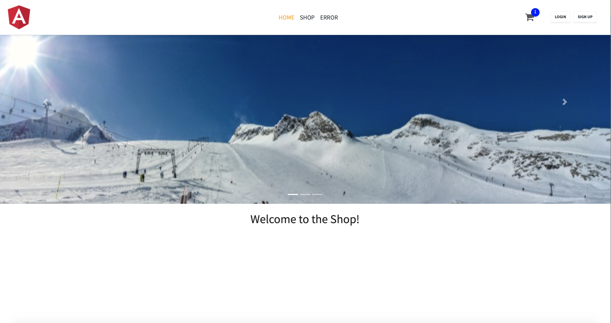
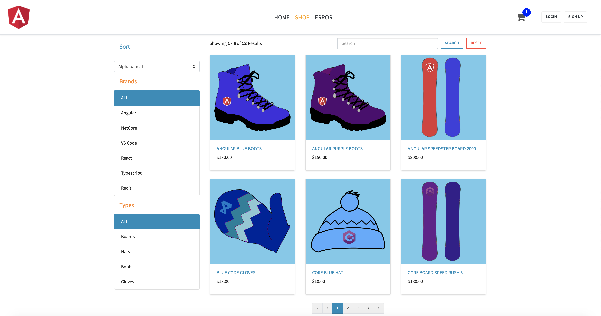
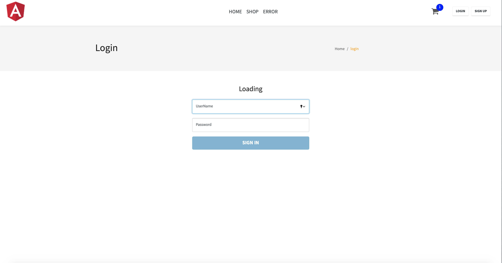
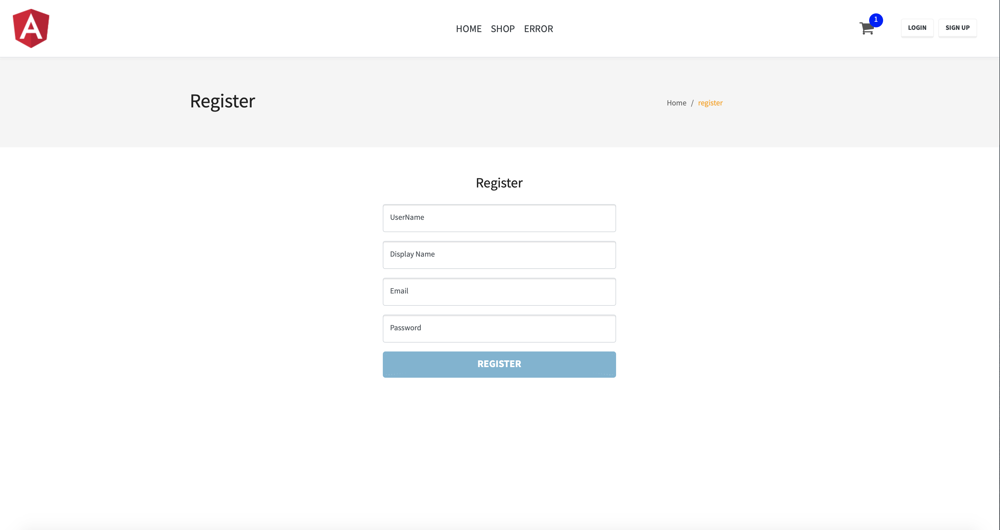
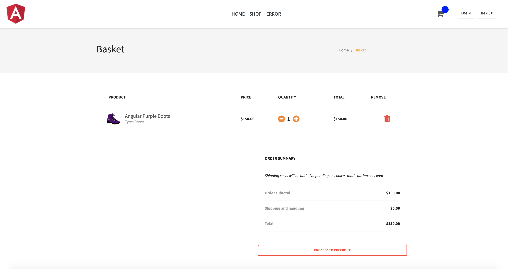

# Structure of Solution
- Core
- Infrastructure
- API
- Dashboard

# Technologies
- .Net Core 3.1
- ASP.NET Core 3.1
- Entity Framework Core 3.1
- Angular 9

# Implementations
- Entity pattern
- Repository Pattern
    - Generic Repository
    - Unit of Work 
    - Specification
- Entity Framework Core
    - Fluent Mapping
    - Sql Lite
    - Automatic Seed
    - Eager & LazyLoading strategy
- Dto pattern
- AutoMapper for Dto object - Shapping Data
- Static File Middleware - Serving Static File from API
- API Error Handling
    - Api Response Model for Representing
    - Exception Middleware
    - ApiBehaviorOptions configured
- Swagger Documentation Implementation
- Paging & Filtering & Sorting & Searching
- Redis Cache Implementation
    - Cache Attribute
- Validation with DataAnnotations Attribute
- Authentication and Authorization Middleware
    - Identity Implementation
    - JWT - JSON Web Token Implementation
    
- Angular Dashboard
    - Core Module
    - Shared Module
    - Feature Module
    - Guards
    - Interceptors

  Outputs:
  
  
  
  
  